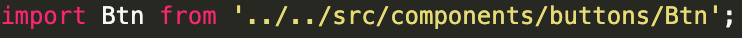
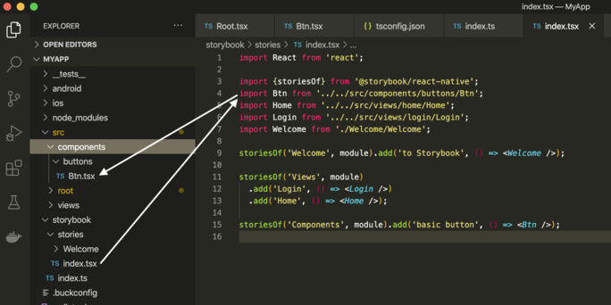
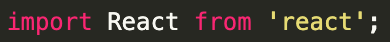
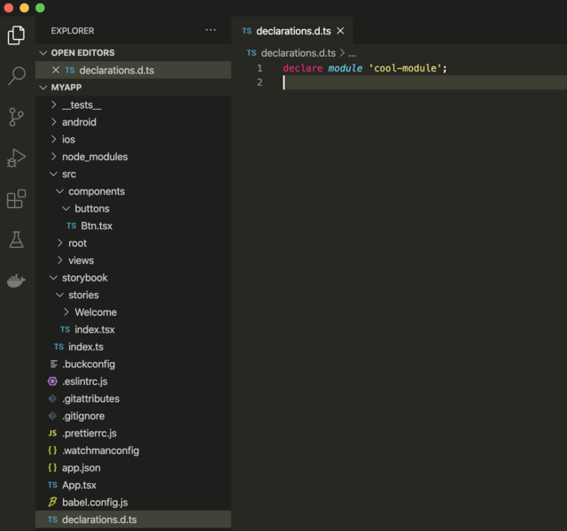
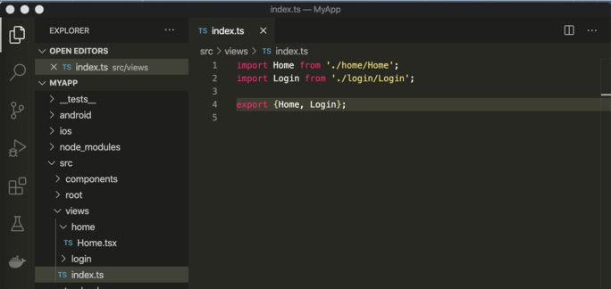
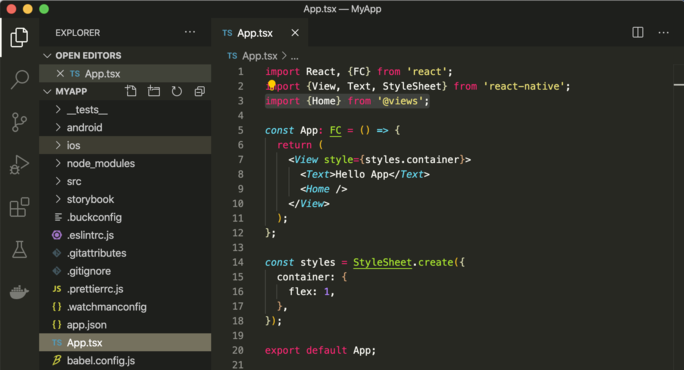
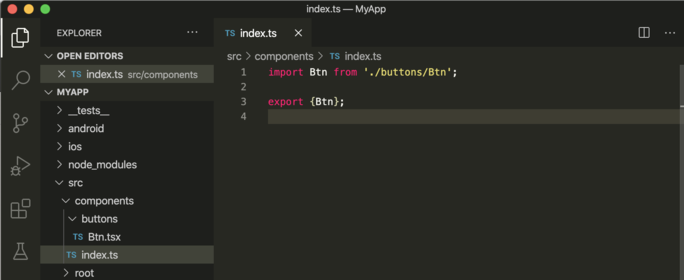
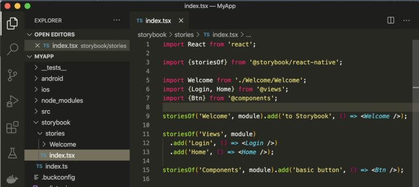

# Part 2: RN CLI, TS module resolving

# TS setup module resolution
This used to give me nightmares for such a long time, but now i think it's a must have practice.<br>

## tsconfig setup
open `tsconfig.json` file and change "jsx": "react",  ->  "jsx": "react-native",

### setting up "baseUrl" and "paths"
#### theory time  💪

there are some key differences how typescript resolves import modules 
- relative
<br>
where you add dots and the module you are importing is relative to the directory or file you are currently in this example we are in 'storybook/stories/index.tsx. this means you are first (../) looking one folder up in 'storybook' , then another folder up (+../) in root, then +src/components/buttons/Btn<br>

<br>

- non-relative<br>
<br>

these modules are resolved in relation to the "baseUrl" , if such is specified, if not then these modules are resolved in relation to tsconfig file itself. Usually these would be your node_modules. Also such modules can be resolved to 'ambient modules' ambient modules are basically 'd.ts' files. 

(off topic)<br>
_common usecase of an ambient module declaration would be when you try to use some library which does not support typescript and you cannot find types anywhere in the whole internets. So in root you can create file called something like 'types.d.ts' or 'declarations.d.ts' and in that file you can declare your missing npm module type like 'declare module "name-of-the-npm-package-you-want-to-use";' and now this npm package's import would be treated as 'any type' which would look something like this_<br>
<br>
_anyway, back to topic._

there are three reasons to not use only relative imports:<br>
- first they can grow to extreme lengths, if you are building real life app, chances are your imports might start to look something like this at some point 
`../../../../../../../../../folder/folder/folder/component`<br>
which, i can promise you, will be PAIN to deal with.

- second , you can just look cool knowing these mechanics. so put your sunglasses on and let's continue configuring.

in your `tsconfig.json` file add `"baseUrl": "./"` this means that our non-relative imports will be relative to this path...which is root

_tsconfig.json_<br>
```
{
  "compilerOptions": {
    "allowJs": true,
    "allowSyntheticDefaultImports": true,
    "esModuleInterop": true,
    "isolatedModules": true,
    "jsx": "react-native",
    "lib": ["es6"],
    "moduleResolution": "node",
    "noEmit": true,
    "strict": true,
    "target": "esnext",
    "baseUrl": "./"
  },
  "exclude": [
    "node_modules",
    "babel.config.js",
    "metro.config.js",
    "jest.config.js"
  ]
}
```
now let's start adding our modules , we already have made few basic components and we can stick to this file structure since it is already pretty solid base for an application.
so we will declare custom module paths to 'components', 'views' and 'root'. i will explain a lot of what's going after the samples in another theory section below.

_tsconfig.json_
```
...
"baseUrl": "./",
    "paths": {
      "@views": ["src/views"],
      "@views/*": ["src/views/*"],
      "@components": ["src/components"],
      "@components/*": ["src/components/*"]
    }
...
```
install babel typescript plugin resolver<br>
`npm install --save-dev babel-plugin-module-resolver`<br>

edit babel.config.js located in root<br>
_babel.config.js_
```
module.exports = {
  presets: ['module:metro-react-native-babel-preset'],
  plugins: [
    [
      'module-resolver',
      {
        root: ['./'],
        extensions: ['.ios.js', '.android.js', '.js', '.ts', '.tsx', '.json'],
        alias: {
          '@components': './src/components',
          '@views': './src/views',
          '@root': './src/root',
        },
      },
    ],
  ],
};
```
'trick' part:<br>
you will need to start 'indexing' your components. So navigate to `src/views` and create `index.ts` file
and import/export default components in your view directory (we have Login and Home so far)

_src/views/index.ts_<br>
<br>

fix imports<br>
in `App.tsx` replace previous Home import to now existing 'views' non-relative module

_App.tsx_<br>
<br>

now , index your 'components' , just like previously we did with views. in `src/components` create file `index.ts` and import all your components, we have only the basic button component

_src/components/index.ts_<br>


now we fix imports in `storybook/stories/index.tsx` , same as we did in `App.tsx` - 
replace previous Login, Home and Btn imports to non-relative module imports

_storybook/stories/index.tsx_<br>
<br>

Thats it. you have non-relative imports now for your component modules.

## In Depth...
#### theory time
_(further examples are not going to be part of the project, just code snippets and examples you don't need to include them if you don't want to)_<br>
 So if you follow the official react native docs<br>
https://reactnative.dev/docs/typescript#using-custom-path-aliases-with-typescript you will notice that your code will not compile with these custom aliases. And it took me DAYS to understand why, as i stumbled upon a stackoverflow thread where one comment, yes just a comment, not even an answer, vaguely mentions, that RN pathing does not really work like Typescript pathing. So even if you did everything , described in RN docs, all you will see in your app is just a red screen of death, pain, and suffering. So i already showed you one of the 'workarounds' - the indexing method. Typescript documentation mentions package.json method , described here https://www.typescriptlang.org/docs/handbook/module-resolution.html#how-typescript-resolves-modules , but this also does not work. Instead of just 'types', as described in docs, i made package.json file in src/views/ with this content.<br>
_src/views/package.json_<br>
```
{
  "name": "@views",
  "main": "index.ts"
}
```
and it actually worked, but i still needed to add the same index.ts file with imports/exports of all packages. Also i could use the same imports as described previously, this method just added one extra file to project.

Another method, If you want to import your modules separately, you can create separate index.ts files with import/export statements,  in src/home create index.ts file with this content:
```
import Home from './Home';
export {Home};
```
now you can import Home separately like this

_App.tsx_
```
...
import {Home} from '@views/home/index';
...
```
OR ... :) create package.json file in src/views/home

_src/views/home/package.json_
```
{
  "name": "@views/home/Home",
  "main": "./Home.tsx"
}
```

and import default Home component, which also gives you freedom to instantly rename it however you like this<br>

_App.tsx_
```
import Home from '@views/home/Home';
```
_App.tsx (default import rename)_
```
import Lala from '@views/home/Home';

const App: FC = () => {
  return (
    <View style={styles.container}>
      <Text>Hello App</Text>
      <Lala />
    </View>
  );
```
as you can see there are quite a few options, but the one i showed you in "configuration" section, to me seems like cleaner option. Especially when your application grows, and you have tenths and tenths of components , it is much more cleaner to import them with a single import rather than long list of individual imports. 

```
import {Button, AnotherButton, ThirdButton, Card, Cat} from '@components';
```
vs
```
import {Button} from '@components';
import {AnotherButton} from '@components';
import {ThirdButton} from '@components';
import {Card} from '@components';
import {Cat} from '@components';
```
That's all for part 2 i hope this helped someone out or maybe learned something new about typescript module resolving.
